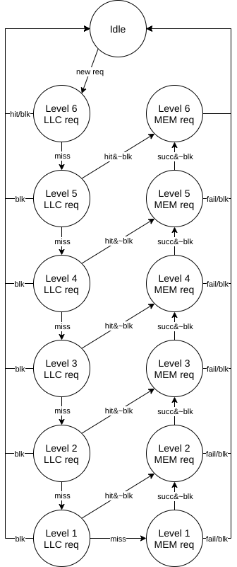
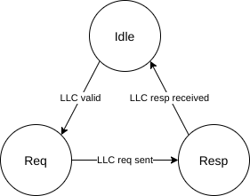
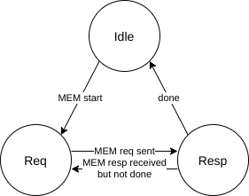

# MidgardMMU MAS

## Revision histroy

|      |            |             |                 |
| ---- | ---------- | ----------- | --------------- |
| 0.01 | 2020-12-17 | Yuanlong Li | Initial version |

## Terminology

The terminologies used in this document are shown in in the following table:

| Terminology                  | Acronym | Description                                                  |
| ---------------------------- | ------- | ------------------------------------------------------------ |
| `Midgard` Address            | `MA`    | Memory address used by the cache hierarchy                   |
| Physical Address             | `PA`    | Memory address used by the main memory                       |
| Page Table Entry             | `PTE`   | The data structure defined by the `ISA` to store the `MA`-to-`PA` mappings in a hierarchical way |
| Page Table Walk              | `PTW`   | The procedure to traverse down the `PTE` hierarchy to perform the `MA`-to-`PA` translation |
| Memory Management Unit       | `MMU`   | A hardware unit than handles the translation from `MA` to `PA` automatically |
| Translation Lookaside Buffer | `TLB`   | A hardware unit that caches the recent `MA`-to-`PA` translations to reduce the translation latency |
| Translation Walk Cache       | `TWB`   | A hardware unit that caches the recent `PTE`s to reduce the `PTE` fetching latency |

## Overview

The `MidgardMMU` implements the in-cache translation for `Midgard` project. It receives miss request from `LLC` requiring its `MA` to be translated, and responses with the translated `PA`, generated by performing page table walk from `PTE`s from either `LLC` and main memory.

## Parameter

The following table shows all the configurable parameters that `MidgardMMU` supports, along with their default values and descriptions.

| Parameter   | Default value | Description                           |
| ----------- | ------------- | ------------------------------------- |
| `maBits`    | 64            | Number of bits of a `MA`              |
| `paBits`    | 48            | Number of bits of a `PA`              |
| `tlbEn`     | 1             | Whether to enable `MidgardTLB` or not |
| `tlbSetNum` | 1024          | Number of sets in `MidgardTLB` cache  |
| `tlbWayNum` | 4             | Number of ways in `MidgardTLB` cache  |
| `twbEn`     | 1             | Whether to enable `TWB`               |
| `twbNum`    | 32            | Number of entries in `TWB`            |

## Interface

The following table shows the interface signals of `MidgardMMU`.

| Name         | Dir  | Type                                                         | Description |
| ------------ | ---- | ------------------------------------------------------------ | ----------- |
| `mmu_req_i`  | `I`  | Flipped decoupled wire of `maBits-12` bits                   |             |
| `mmu_resp_o` | `O`  | Decoupled wire of `paBits-12` bits                           |             |
| `llc_req_o`  | `O`  | Decoupled wire of `maBits` bits                              |             |
| `llc_resp_i` | `I`  | Flipped decoupled wire of `65` bits     Bit `[64  ]`: Whether the request hits `LLC`     Bit `[63:0]`: Requested `PTE` |             |
| `mem_req_o`  | `O`  | Decoupled wire of `paBits` bits                              |             |
| `mem_resp_i` | `I`  | Flipped decoupled wire of `65` bits     Bit `[64  ]`: Whether a bus error occurs     Bit `[63:0]`: Requested `PTE` |             |
| `cfg_req_i`  | `I`  | Flipped decoupled `MidgardCfgReq`     `addr`: 4-bit wire     `data`: 64-bit wire |             |
| `cfg_resp_o` | `O`  | Decoupled `MidgardCfgResp`     `vld`:   1-bit wire     `data`: 64-bit wire |             |

## Function

The following sections provide an overall introduction to the functionalities of `MidgardMMU`.

### Top-level structure

The following figure shows the top-level block diagram of `MidgardMMU`.

Incoming `mmu_req` is first sent to the `MidgardTLB` to check whether an existing `TLB` entry can directly provide the translation. If the request misses the `TLB`, then it is sent to the `MidgardPTW` to do the in-cache `PTW`. Once the `PTW` is done, `MidgardPTW` returns a newly-generated `TLB` entry to `MidgardTLB`. `MidgardTLB` writes it into the `SRAM`s and returns a response.

During the `PTW`, `MidgardPTW` needs to calculate the `MA` and `PA` of the `PTE`s for each required level of translation. It generates requests to `LLC` (in the `MA` space) and main memory (in the `PA` space) to fetch the corresponding `PTE` back.

### In-Cache Translation

TODO

The `Midgard` addresses and physical addresses used to access `PTE`s of each level of translation in `LLC` and memory are listed in the following table.

| Level | `Midgard` address                 | Physical address                 |
| ----- | --------------------------------- | -------------------------------- |
| 1     | `{base1[63:10], ma[63:57], 3'b0}` | `{root[47:10], ma[63:57], 3'b0}` |
| 2     | `{base2[63:19], ma[63:48], 3'b0}` | `{pte1[47:12], ma[56:48], 3'b0}` |
| 3     | `{base3[63:28], ma[63:39], 3'b0}` | `{pte2[47:12], ma[47:39], 3'b0}` |
| 4     | `{base4[63:37], ma[63:30], 3'b0}` | `{pte3[47:12], ma[38:30], 3'b0}` |
| 5     | `{base5[63:46], ma[63:21], 3'b0}` | `{pte4[47:12], ma[29:21], 3'b0}` |
| 6     | `{base6[63:55], ma[63:12], 3'b0}` | `{pte5[47:12], ma[20:12], 3'b0}` |

Where `pteX` is the `PTE` that corresponds to the `X`th level of translation. 

## Submodule

### `MidgardTLB`

`MidgardTLB` is a conventional `TLB` for the in-cache translations. It is the `BTLB` in the `Midgard` paper.

As conventional L2 `TLB`s, `MidgardTLB` is structured as a set-associative cache, with both set and way configurable.

#### Parameter

The following table shows derived parameters of `MidgardTLB`.

| Name       | Default value | Description                                 |
| ---------- | ------------- | ------------------------------------------- |
| `tlbSetHi` |               | Index of the highest set bit of the address |
| `tlbSetLo` |               | Index of the lowest set bit of the address  |
| `tlbTagHi` |               | Index of the highest tag bit of the address |
| `tlbTagLo` |               | Index of the lowest tag bit of the address  |

#### Interface

The following table shows the interface signals of `MidgardTLB`.

| Name         | Dir  | Width                       | Description |
| ------------ | ---- | --------------------------- | ----------- |
| `tlb_req_i`  | `I`  | Decoupled `maBits-12`       |             |
| `tlb_resp_o` | `O`  | Decoupled `paBits-12`       |             |
| `ptw_req_i`  | `I`  | Decoupled `maBits-12`       |             |
| `ptw_resp_o` | `O`  | Decoupled `MidgardTlbEntry` |             |

#### Function

`MidgardTLB` leverages a 3-stage pipeline to access the `TLB` `SRAM`s. The structure of the pipeline is shown in the following figure.

Different jobs are done in these pipeline stages:

- `s0` stage

  Perform the `tlb_req_i` handshake;

- `s1` stage

  Access all the `TLB` `SRAM`s; 

- `s2` stage

  Read out the `TLB` entries from all the ways, perform tag comparisons, and generate hit/miss signals.

  - If the request hits, then `MidgardTLB` performs a mux to obtain the final `TLB` entry, and sends response at the same time.
  - If the request misses, then `MidgardTLB` generates a page table walk request to `MidgardPTW`, and calculates a way to be replaced.

Once `MidgardPTW` returns a `TLB` entry, `MidgardTLB` writes it into the replaced way, and sends out response.

### `MidgardPTW`

`MidgardPTW` receives page table walk request from `MidgardTLB`, performs the in-cache translation, generate a new `TLB` entry for the request, and then sends it back to `MidgardTLB`.

#### Parameter

The following table shows derived parameters of `MidgardPTW`.

| Name     | Default value | Description                                              |
| -------- | ------------- | -------------------------------------------------------- |
| `ptwLvl` |               | Number of levels of translation                          |
| `ptwTop` |               | Number of bits to be used in the first level translation |

#### Interface

The following table shows the interface signals of `MidgardPTW`.

| Name         | Dir  | Width                       | Description |
| ------------ | ---- | --------------------------- | ----------- |
| `ptw_req_i`  | `I`  | Decoupled `maBits-12`       |             |
| `ptw_resp_o` | `O`  | Decoupled `MidgardTlbEntry` |             |
| `llc_req_o`  | `O`  | Decoupled `maBits`          |             |
| `llc_resp_i` | `I`  | Decoupled `65` bits         |             |
| `mem_req_o`  | `O`  | Decoupled `paBits`          |             |
| `mem_resp_i` | `I`  | Decoupled `65` bits         |             |
| `cfg_i`      | `I`  | `Vec` of `maBits`           |             |

#### Function

##### State Machine

`MidgardPTW` uses the following state machine to perform the above described in-cache translation.

As shown above, the state machine can be split into two parts: `LLC` part and `MEM` part.

###### `LLC` Part

The state machine starts from the `Idle` state. When `MidgardPTW` receives a new request from `MidgardTLB`, it jumps to the `Level 6 LLC req` state, which corresponds to the starting level of the translation. In this state `MidgardPTW` sends a request to `LLC` to lookup the L6 `PTE`. If the `PTE` is already in the `LLC`, then the `TLB` entry for the request can be constructed and returned to `MidgardTLB`, and the state machine jumps back to `Idle`. If the `PTE` is not in the `LLC`, then the L5 translation must be performed to obtain the L5 `PTE`, which determines the physical address of L6 `PTE`s and whether the L5 translation is the last level of translation, corresponding to a huge page.

The same handling would also be performed in higher levels recursively. Formally, If level `n` `PTE` hits `LLC`, then the physical address of level `n+1` `PTE` can be constructed, and the state machine jumps to the `MEM` part to continue the level `n+1` translation. If the `PTE` of level `n` misses `LLC`, then the level `n-1` translation should be performed, making the state machine jumping down (as shown in the above figure). If all all the `PTE`s miss `LLC` altogether, then the state machine would jump to the `L1_MEM` state to start a traditional top-down page table walk.

`MidgardPTW` leverages the following sub state machine in each `LLC` states to manage the interaction with `LLC`, e.g., handshakes of sending requests and receiving responses:

If the `LLC` returns an invalid `PTE`, then the state machine directly jumps to the idle state, and `MidgardPTW` generates a error response to `MidgardTLB`.

###### `MEM` Part

After the state machine completes the `LLC` part, indicating that a missed `PTE` should be fetched from memory, it switches to the `MEM` part. In each `Ln_MEM` state, `MidgardPTW` sends a request to the main memory, retrieves the `PTE` back, constructs the physical address for the `n+1` level `PTE`, and makes the state machine jumps upward (as shown in the figure). This procedure continuous until L6 translation is performed, or the walker encounters a huge page or invalid `PTE`.

`MidgardPTW` leverages the following sub state machine in each `MEM` states to manage the interaction with lower level memory:

##### Table Walk Buffer

To exploit the locality in translation (to some extent), recently fetched `PTE`s are stored in Table Walk Buffer (`TWB`) to be reused in later translation procedures. The `TWB` is a fully-associative "cache" constructed as a flop array, and adopts a pseudo-random (LFSR) replacement policy. The tag of each `TWB` entry is the `Midgard` address of the corresponding `PTE`, while the data part is the `PTE` itself.

`TWB` is read only when the state machine is in the `LLC` part, more specifically, in the `Idle` state of the `LLC` substate. Once `TWB` hits, then it fully bypasses the `LLC` to provide the `PTE`. Besides this, the main control flow remains the same if `TWB` is absent.

Each new `PTE` that is recently fetched from main memory is cached in the `TWB`.

## Integration to `RocketChip`

